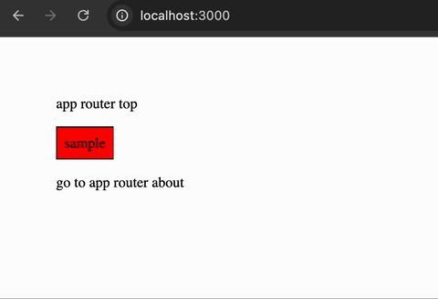
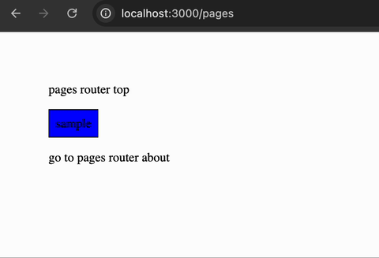

# css modulesのおかしな挙動サンプル

## App Router

```bash
# webpack
npm run dev:w

# or

# turbopack
npm run dev:t
```

1. `/`へアクセス
2. `/about`へ遷移
3. ブラウザバック or `/`へ遷移
4. ボタンが白いまま



| | | 問題あり |
-- | -- | --
| dev | webpack | o |
| dev | turbopack | o |
| prd | webpack | - |
| prd | turbopack | - |

## Pages Router

```bash
# webpack
npm run dev:w

# or

# turbopack
npm run dev:t
```

1. `/pages`へアクセス
2. `/pages/about`へ遷移
3. ブラウザバック or `/`へ遷移
4. ボタンが白いまま



| | | 問題あり |
-- | -- | --
| dev | webpack | -  |
| dev | turbopack | o |
| prd | webpack | - |
| prd | turbopack | - |
